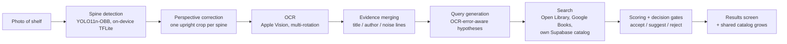
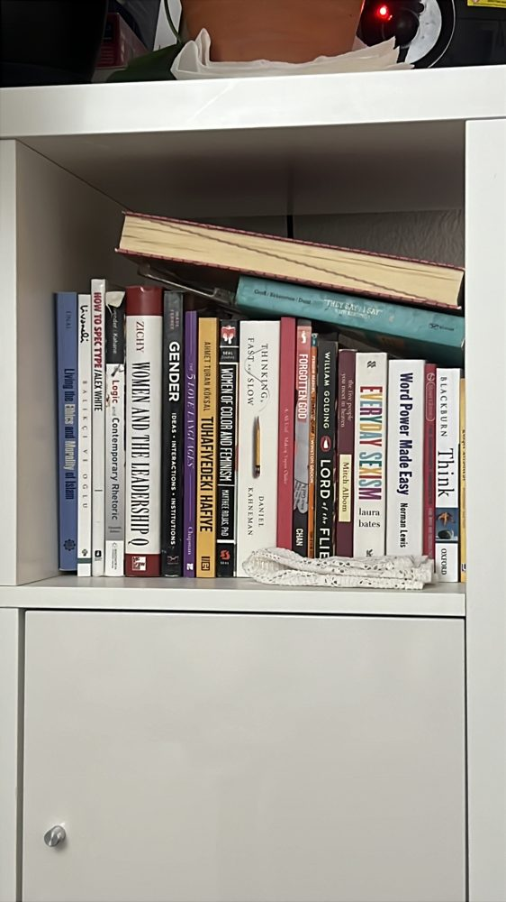
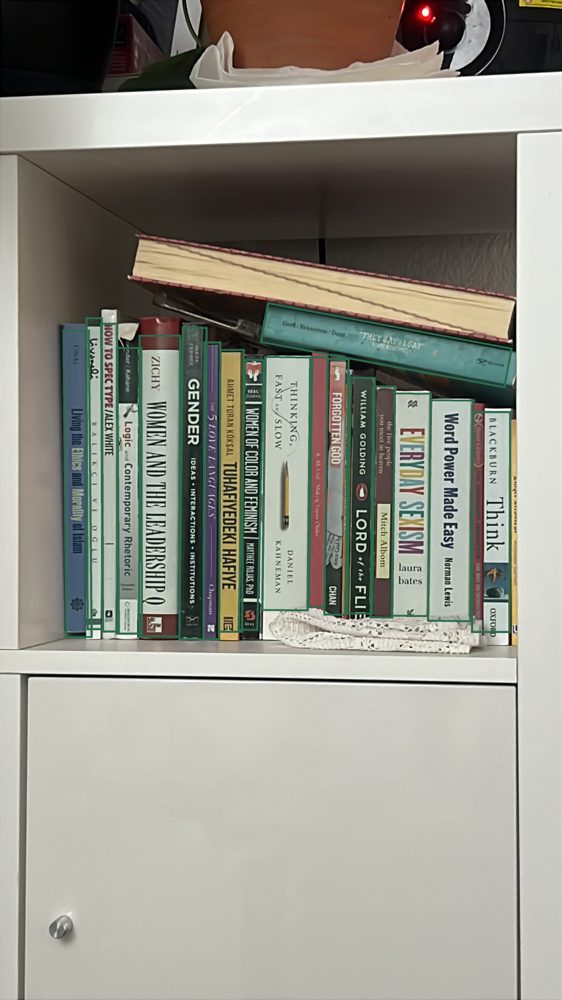
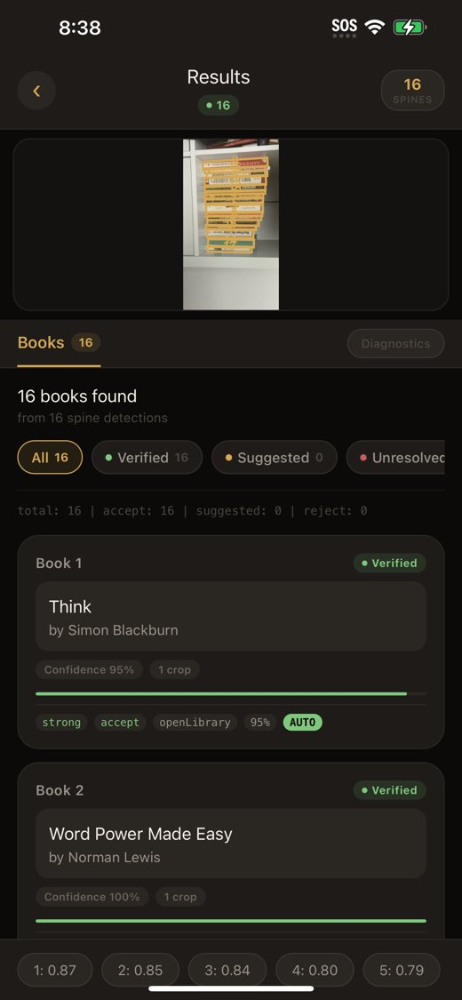
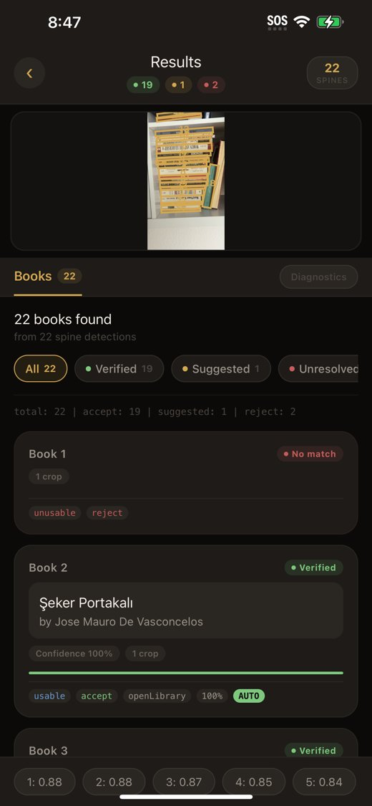
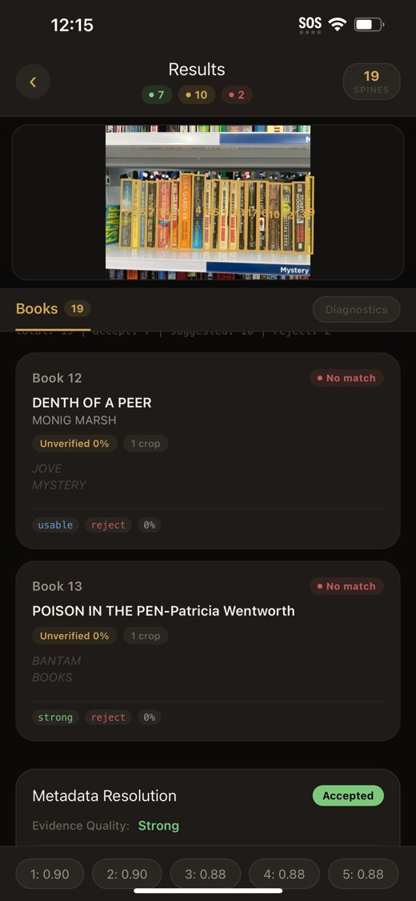
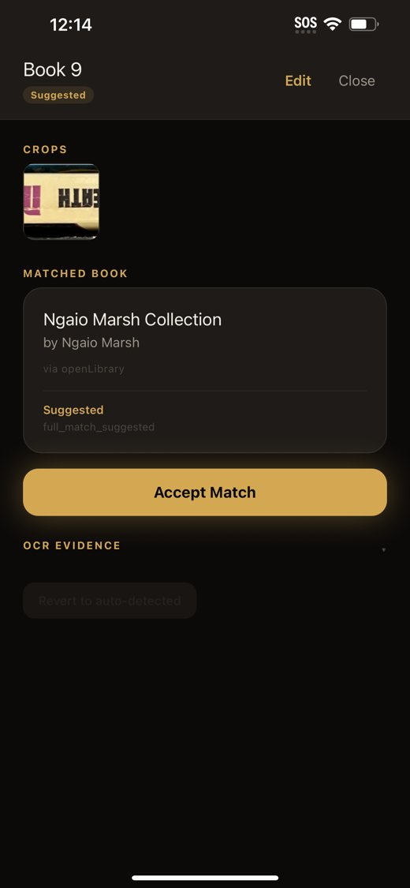
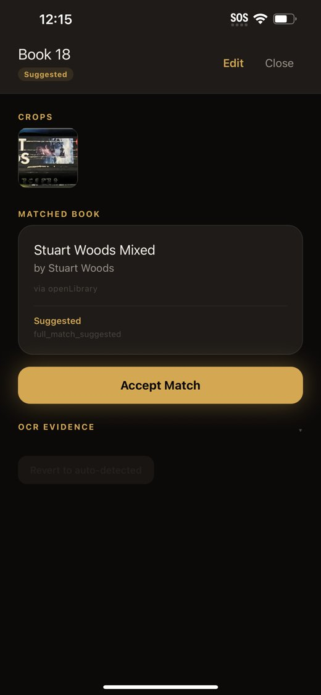

# BookScanner: Cataloging Bookshelves From a Single Photo

**Presenters:** Mustafa Doğan and team
**Status:** Working end-to-end prototype on iPhone (iOS 18), January–September 2026
**Repository:** private GitHub repository `mustafaddogann/BookScanner`

---

## 1. The idea in one sentence

Point a phone at a bookshelf, take one photo, and get a structured list of the visible books the system can resolve (title, author, publisher, ISBN), without scanning barcodes one by one.

> **How to use this document.** Sections 1–8 are the talk, roughly one slide each. The appendices hold the technical detail for questions afterwards.

## 2. Why this problem

- Bookstores, second-hand sellers, school and home libraries still build inventories by hand or by scanning one barcode per book.
- On a shelf, only the **spine** is visible. Spines are narrow, rotated, and mix fonts, languages and publisher logos, so general-purpose OCR does poorly on them.
- Our own use case is Turkish and English books side by side, which adds diacritics (ç, ğ, ı, ö, ş, ü) that many tools handle badly.

The problem combines **computer vision** (finding each spine), **OCR** (reading noisy text), and **information retrieval** (matching noisy text to a real book record).

## 3. What we built

A React Native app (iOS first) that runs the whole pipeline from a single photo:



| Stage | What it does | Technology |
|---|---|---|
| Detection | Finds every spine as a rotated box | YOLO11n-OBB fine-tuned by us, TFLite on device |
| Rectification | Straightens each spine into its own image | Native iOS (CoreImage / OpenCV) |
| OCR | Reads the spine text in several orientations | Apple Vision |
| Evidence merging | Separates title, author, publisher and badge text ("NEW YORK TIMES BESTSELLER") | Rule-based classifier with person/title scoring |
| Query generation | Builds up to 5 search queries, plus up to 25 in a second "boost" pass, correcting typical OCR errors (TIE→THE, joined words, missing letters) | TypeScript |
| Search | Looks candidates up in public catalogs and in our own catalog | Open Library, Google Books, Supabase Postgres with trigram fuzzy search |
| Decision | Scores each candidate and decides whether to auto-accept, suggest, or reject | Token-level F1 with OCR-aware fuzzy matching and ambiguity gates |
| Growing catalog | Accepted books are stored, so later scans have more to match against | Supabase `books_catalog` |

Scans can run in the background while the user keeps shooting, and results are browsable per session and as an aggregated "My Shelf".

**One real scan, stage by stage:**

 

*Left: the photo, taken in the app. Right: the 18 spines the detector found. Each box becomes its own straightened image, which is what the OCR reads.*

**What the user sees.** Automatic matches are marked *Verified*; anything the app is unsure about waits as a suggestion the user confirms with one tap.



*17 September: 16 spines. 15 matched automatically, the last confirmed with one tap.*



*16 September: 22 spines. 14 automatic, 5 confirmed by the user, 1 left as a suggestion, 2 unresolved.*

## 4. Technical contributions

1. **Spine detector trained for this task.** We trained an oriented-bounding-box model, because axis-aligned boxes overlap badly on tilted spines. We started from the public *Open Shelves* dataset and added our own annotated shelf photos (Section 5.1). The model runs on the phone, with no server needed for detection.
2. **Evidence-based metadata resolution.** Instead of trusting one OCR "title" guess, the app treats all recognized lines as evidence. It generates several search hypotheses and scores every returned book against the evidence.
3. **Explicit decision gates with measured thresholds.** Every match is labeled *accept*, *suggest*, or *reject*, with a stated reason (for example `anchored_title_surname_match`). Thresholds live in one config file and were tuned against real scans (Section 5).
4. **Handling real-world noise.** Examples we found in real scans and fixed:
   - Turkish letters were being dropped ("Ünal" became "nal").
   - Words joined by OCR ("venderKahane") are split.
   - Study guides ("William Golding's Lord of the Flies") and misspelled catalog records no longer count as competing matches.
   - Marketing badges are removed from a line instead of discarding the whole line.
5. **A catalog that keeps expanding.** Every accepted book is stored, so the pool the app can search grows with use. This improves retrieval on later scans, especially for badly read spines; the model itself does not retrain.

## 5. Results so far

### 5.1 Spine detection model

Fine-tuned from Ultralytics' YOLO11n-OBB checkpoint for 100 epochs on 640×640 images with a single class (`book`).

**Data.** Two datasets, both annotated and exported with Roboflow, merged by our own script (`ml/merge_datasets.py`), which also converts the YOLOv5-OBB label format to YOLOv8-OBB:

| Source | Images | Origin |
|---|---|---|
| [Open Shelves v9](https://universe.roboflow.com/capjamesg/open-shelves) | 496 | Public dataset by Roboflow user *capjamesg*, CC BY 4.0 |
| [Book Spine Detection v1](https://universe.roboflow.com/mustafas-workspace-qkrgv/book-spine-detection-wbfbq) | 51 | **Ours:** 24 photos of our own shelves, annotated by us, augmented ×3 |

Image counts are after Roboflow's preprocessing and augmentation (resize to 640×640, small rotations, brightness/exposure jitter, salt-and-pepper noise).

| Split | Images | Annotated spines |
|---|---|---|
| Train | 491 | 15,203 |
| Validation | 39 | 1,020 |
| Test | 17 | 456 |

| Metric (validation, final epoch) | Value |
|---|---|
| Precision | 0.864 |
| Recall | 0.854 |
| mAP@50 | 0.876 |
| mAP@50–95 | 0.675 |

On a real shelf photo the detector typically finds 18–22 spines, and on-device detection takes about 1.3 s.

### 5.2 End-to-end matching on real shelves

We photographed the same real bookshelf repeatedly while improving the resolver. Each photo is taken fresh, so the number of detected spines varies.

| Scan (in time order) | Spines detected | Auto-accepted | Suggested (user confirms) | Rejected | Auto-accept share |
|---|---|---|---|---|---|
| Early builds (5 scans) | 16–20 | 8–10 | 6–9 | 1–3 | 40–56% |
| After fixing cross-scan result mixing | 18 | 11 | 6 | 1 | 61% |
| After same-work and author-scoring fixes (2 scans) | 17–22 | 8–14 | 6 | 2–3 | 47–64% |
| After query-generation fixes | 19 | 12 | 6 | 1 | 63% |
| After threshold tuning | 19 | 12 | 5 | 2 | 63% |

- **Precision of the auto-accepts: 56 of 57.** This is the share of *auto-accepted* books that were the right book, not the share of the shelf that was cataloged. Taking the most recent scan as an example: of 19 detected spines, 12 were auto-accepted, 5 were correct but needed one tap to confirm, and 2 were rejected. So 17 of 19 were resolved correctly, 12 of them with no user effort.
- **The one wrong auto-accept.** Only "Mitch Albom" was readable on a spine, and a catalog record titled "The live Albom" got title credit for the author's name. We fixed the scoring so a title word that is also the author's name no longer counts as title evidence, and added a regression test built from that spine.
- **Suggestions were mostly right, so we tuned the auto-accept rule on them.** Across 12 stored scans, 69 matches were only suggested. Suggestions scoring ≥ 0.65 with an author surname read from the spine were almost always correct. Applied to the stored scans, the new rule turns about 29 of the 69 into automatic accepts, and every one of them is a book that is actually on the shelf. One came from a crop that covered two spines, so it names the neighboring book.
- **The two wrong high-scoring suggestions** we found are both still excluded, because neither had an author match.
- **Not yet measured on a new scan:** the two most recent changes, fuzzy search in our own catalog and splitting joined words.

### 5.3 Engineering quality

- **Tested against real failures.** 1,208 automated tests in 46 suites, all passing. New tests are written from actual scans: the misspelled record, the joined author name, the wrong "Albom" match each have a regression test built from the spine text that caused them.
- **Every change is checked.** Type checking and linting both run clean, so a refactor that breaks a contract fails immediately.
- **Modular by pipeline stage.** Detection, rectification, OCR, evidence merging, query generation, scoring and decision each live in their own module with their own tests, so a stage can be swapped, for example a different OCR engine, without touching the rest.
- **Reproducible.** Training, export and model inspection are scripted (`ml/scripts`, `tools/`), decision thresholds sit in one config file, and the database schema is versioned as 9 SQL migrations.

## 6. Honest limitations

- **Matching speed:** metadata resolution for a full shelf currently takes about 100–125 seconds, because many catalog queries run one after another.
- **OCR is the bottleneck:** most remaining misses come from unreadable spines (small fonts, decorative typefaces, glare), not from the matching logic.
- **Evaluation scale:** our end-to-end numbers come from repeated scans of one real shelf. We do not yet have a large, labeled benchmark of shelves.
- **A denser shelf is much harder.** On a bookstore shelf of mass-market paperbacks, an earlier build (February) resolved far less: of 19 detected spines, 7 were accepted, 10 were only suggested and 2 found nothing. We have not repeated this with the current build, so it is a warning sign rather than a measurement.



*Tightly packed paperbacks, read at an angle: 7 accepted, 10 suggested, 2 unresolved. "DENTH OF A PEER / MONIG MARSH" is* Death of a Peer *by Ngaio Marsh; the misreadings defeated every query.*

 

*The same trap twice: catalogs carry omnibus records, so single spines matched "Ngaio Marsh Collection" and "Stuart Woods Mixed" instead of the individual novels. Study guides are already excluded this way; omnibus records are not, yet.*
- **Platform:** the full pipeline is iOS-only today. Android lacks perspective correction.
- **Model generalization:** the detector was trained on a few hundred images and has not been tested across many shelf styles or lighting conditions.

## 7. Where we would like to go next

These are the research directions where guidance would help us most:

1. **A proper evaluation benchmark:** a labeled set of shelf photos (Turkish and English), with a reproducible scoring script, so improvements can be measured and not just observed.
2. **Better spine OCR:** compare Apple Vision with fine-tuned OCR or a vision-language model that reads the spine and proposes title/author directly.
3. **Learning the decision step:** replace hand-tuned thresholds with a calibrated classifier trained on accepted/rejected matches from users.
4. **Speed:** parallel and cached catalog lookups to bring resolution under 10 seconds per shelf.
5. **Turkish book coverage:** Open Library has limited Turkish data, so we want to integrate Turkish sources and grow our own catalog.

## 8. What we are asking for

- **Academic guidance** on evaluation methodology and on which of the directions above has the most research value.
- **Feedback on scope** for a new project that builds on this work.
- **Possible collaboration:** access to data, compute, or a student research framework, if the professor sees a fit.

In return we bring a working prototype, a trained detector, a labeled dataset, an extensible and tested codebase, and experience shipping computer vision on a phone.

---

## Appendix A: How a scan is decided (example)

Spine OCR lines: `THINKING,` / `FAST AND SLOW` / `DANIEL` / `KAHNEMAN`

1. **Evidence:** title-like lines "THINKING, FAST AND SLOW" and person-like line "DANIEL KAHNEMAN".
2. **Queries (as generated on the real scan):** "fast slow", "fast slow kahneman", "thinking kahneman", "slow kahneman", …
3. **Candidates:** "Thinking, fast and slow" (Kahneman), a misspelled catalog copy "thiking fast and slow", study guides and summaries.
4. **Decision:** the misspelled copy and the study guides are recognized as the same work or derivatives, so they don't count as competitors. The title matches, the surname matches, and the score is high, so the book is **auto-accepted** and shown with the correctly spelled title.

## Appendix B: Technology stack and project size

- **Size:** about 53,500 lines of TypeScript across 54 services, 9 screens and 11 components, plus ~2,600 lines of native Objective-C and 9 SQL migrations.
- **App:** React Native 0.83 (New Architecture, Hermes), TypeScript, Zustand, MMKV
- **Vision:** react-native-vision-camera, react-native-fast-tflite, YOLO11n-OBB (Ultralytics), Apple Vision
- **Backend:** Supabase (Postgres with `pg_trgm`, edge functions), Open Library and Google Books APIs
- **Tooling:** Jest, ESLint, Python tools for model export, inspection and threshold sweeps

## Appendix C: Running the project

```bash
npm install
cd ios && bundle install && bundle exec pod install && cd ..
cp src/config/secrets.example.ts src/config/secrets.ts
npm run ios
```

Model training and export steps are in `README.md`. Architecture details are in `docs/pipeline.md` and `docs/project_plan.md`.

## Appendix D: Credits

- Training data: *Open Shelves* by Roboflow user **capjamesg** (CC BY 4.0), extended with our own *Book Spine Detection* set (CC BY 4.0). Annotation and dataset management: Roboflow.
- Detector architecture and training: **YOLO11n-OBB**, Ultralytics (AGPL-3.0) — relevant if the app is ever distributed.
- Book metadata: Open Library and Google Books APIs.
